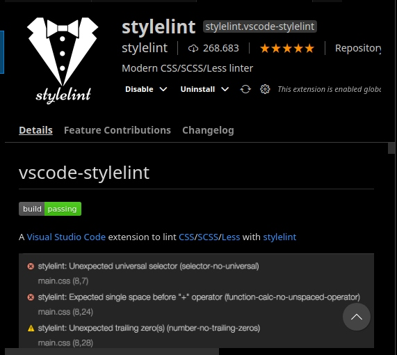

# Stylelint Guide

<a name= "indice"></a>
## **Índice**
* [Instalando la extensión de vscode](#id0)
* [Instalando stylelint como paquete npm](#id1)
* [Generando el fichero de configuración](#id2)
* [Comprobando nuestros archivos *.css](#id3)
* [Enlaces de interés](#id4)

---

<a name="id0"></a>

## Instalando la extensión de vscode
instalamos el stylelint siguiente:

*stylelint.vscode-stylelint*:




[volver arriba](#indice)

----

<a name="id1"></a>

## Instalando stylelint como paquete npm

A continuación, procedemos a instalar tanto el paquete de stylelint como la configuración estándar:

```bash
npm install --save-dev stylelint stylelint-config-standard
```

[volver arriba](#indice)

---

<a name="id2"></a>

## Generando el fichero de configuración

Creamos un .stylelintrc.json en el root del proyecto. Este tendrá una apariencia similar a este, generado como un estándar:

```json
{
	"extends": "stylelint-config-standard",
	"rules": {
			"indentation": 2,
			"string-quotes": "single",
			"no-duplicate-selectors": true,
			"color-hex-case": "lower",
			"color-hex-length": "long",
			"color-named": "always-where-possible",
			"property-no-unknown": true
	}
}
```

[volver arriba](#indice)

----

<a name="id3"></a>

## Comprobando nuestros archivos *.css

Para comprobar todos los .css de nuestro proyecto ejecutamos:

```
npx stylelint "**/*.css"
```

Dado un fichero de prueba como [este](css/error-style.css) quien contiene varios errores de estilo, la ejecución de la instrucción anterior nos arrojará lo siguiente:

```bash
css/error-style.css
 2:4   ✖  Expected indentation of 2 spaces                            indentation                                  
 3:21  ✖  Expected "rgb(0,0,0)" to be "black"                         color-named                                  
 3:26  ✖  Expected single space after "," in a single-line function   function-comma-space-after                   
 3:28  ✖  Expected single space after "," in a single-line function   function-comma-space-after                   
 5:3   ✖  Expected indentation of 2 spaces                            indentation                                  
 6:16  ✖  Unexpected missing generic font family                      font-family-no-missing-generic-family-keyword

```

Esto es debido a que *error-style.css* contiene errores y *style.css* no, por ello, no nos arroja información acerca del segundo fichero mencionado ([style.css](css/style.css)).


[volver arriba](#indice)

----

<a name="id4"></a>

## Enlaces de interés

[Aquí podemos encontrar todas las reglas que podemos aplicar sobre nuestros archivos css](https://stylelint.io/user-guide/rules/list)

[Toda la información acerca de stylelint](https://stylelint.io/)

[Guía de iniciación oficial de stylelint](https://stylelint.io/user-guide/get-started)

---

[volver arriba](#indice)

---